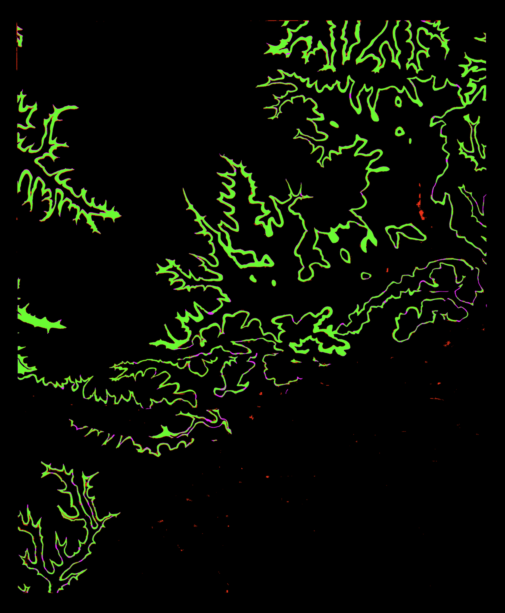

# Validation

This is the UIUC repo for generating debugging and statistics on the performance of model outputs.

## Installation
To get started with this repo you will need to clone the repository and and install [requirements.txt](requirements.txt). We recommend using a python venv to keep the working environment clean.

```
git clone git@github.com:DARPA-CRITICALMAAS/uiuc-validation.git
cd validation
python3 -m venv venv
source ./venv/bin/activate
pip install -r requirements.txt
```

## Usage
Included with this repository is a demo script that can perform validation on a file(s) and/or directory(s). 

```
# Example call to validationDemo.py
python validationDemo.py --data mydata/predictions --true_segmentations mydata/usgs_segmentations --base_maps mydata/map_images --legends mydata/usgs_legends --feedback
```

## Feedback
Preforming validation will produce a csv file with scores for each legend feature. The scores provided are:

* F1 Score
* Precision
* Recall
* Intersection over Union (IoU) **Polygon features only*
* USGS weighted F1 score **Polygon features only*
* USGS weighted precision **Polygon features only*
* USGS weighted recall **Polygon features only*
* Mean matched point distance (in pixels) **Point features only*
* Number of matched points (true positive) **Point features only*
* Number of unmatched points (false positive) **Point features only*
* Number of missing points (false negative) **Point features only*
  
If the `--feedback` parameter is enabled the program will also produce a debug image for each legend feature that is graded. Please note that the feedback image is the same size as the orginal image. The key for these images is as follows :

| ${\color{#4F4}\textsf{Correct Prediction (True Positive)}}$ | ${\color{#f00}\textsf{Incorrect Prediction (False Positive)}}$ |
|:-:|:-:|
| ${\color{#000}\textsf{Nothing Present (True Negative)}}$ | ${\color{#f0f}\textsf{Missing Prediction (False Negative)}}$ |



<center>
Example of a validation image from a UIUC model run on AR_StJoe_Mbs_poly
</center>

## validationDemo Parameters
* **-d, --data** : required<br>
    Path to file(s) and/or directory(s) containing the predicted rasters to grade. The program will grade any `.tif` files provided. File names are expected to match their corresponding map true raster filename. E.g. if there a file `CA_Sage_Mbv_poly.tif` is provided there needs to be a `CA_Sage_Mbv_poly.tif` file in the true raster directory.
* **-t, --true_segmentations** : required<br>
    Directory containing the true raster segmentations to grade against.
* **-b, --base_maps** : required<br>
    Directory containing the base map for the segmentation.
* **-l, --legends** : required<br>
    Directory containing the legend jsons for the maps.
* **-f, --feature_type** : required<br>
    Type of feature that will be graded on, will be used if the feature type can't be detected from the file name. Available features are Point or Polygon.
* **-o, --output** : optional<br>
    Directory to write the validation feedback to. Defaults to "results". The outputs currently created include a visualization image of the validation for each legend and a csv containing the scores for each legend processed. If the directory does not exist, it will be created.
* **--log** : optional<br>
    Option to set the file that logging will write to. Defaults to "logs/Latest.log".
* **-v, --verbose** : optional<br>
    Flag to change the default logging level of INFO to DEBUG.
* **--feedback** : optional<br>
    Flag to enable the saving of debugging feedback images.

## Authors and acknowledgment
This repo was created by and is maintained by the amazing UIUC team.
